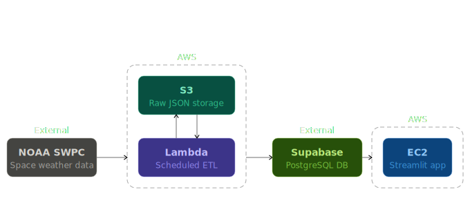
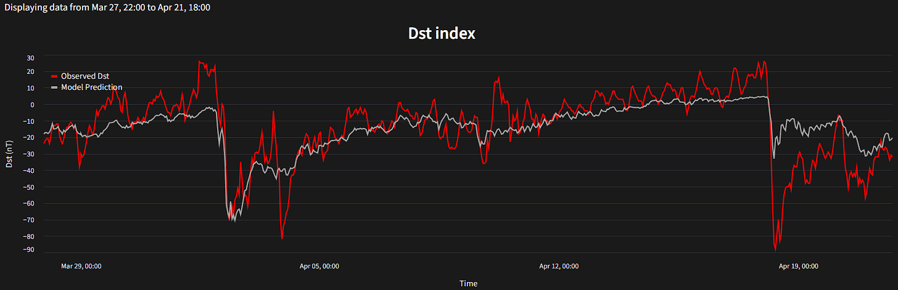

# Space Weather Dashboard

The goal of this project was to create a space weather dashboard, a useful tool that provides people and organizations time to prepare for severe solar storms. This included creating a full ETL pipeline for space weather data with extraction, transformation and loading phases. The ETL pipeline was followed by an interactive web application developed using Streamlit and deployed onto Streamlit Community Cloud.

[Live Dashboard Link](https://spaceweatherdashboard.streamlit.app/)

**Note:** The app and database are hosted on free tiers and may need a moment to wake up on first load.

---

## Tech Stack

**AWS** (Lambda · ECR · EventBridge · S3 · CloudWatch · SNS) · **Streamlit** · **PostgreSQL** · **Pandas** · **Keras / TensorFlow** · **Python**

---

## Architecture

---
## Core Logic

This project is engineered as a decoupled system where data ingestion and visualisation operate independently to ensure high availability and UI responsiveness.

### 1. Automated ETL Pipeline
* **Extract:** Pulls near-real-time JSON data from NOAA API endpoints.
* **Transform:** Uses Pandas to clean, align, and transform datasets.
* **Load:** Saves raw extracted JSON to AWS S3, then upserts transformed data into a serverless PostgreSQL database hosted on Supabase, replacing the previous 24 hours of data to account for any updates at source.
* **Fault Tolerant:** The pipeline is resilient at every stage. Extraction failures do not affect the transform step, which falls back to the latest raw data in S3. Transform failures do not affect the dashboard, which reads from the cloud database. In the event of database failure, raw data persisted in S3 ensures the database can be fully reproduced.
* **Schema Flexible:** Handles format changes in NOAA API responses. After observing the Dst and Kp Index endpoints switching from a list of lists to a list of dictionaries format, format detection was introduced at extraction time to parse either structure correctly. The pipeline is also forward-compatible with future switches between the two formats.

### 2. ML Inference

* A CNN model trained using Keras / TensorFlow generates Dst Index predictions at the end of each ETL cycle using full hourly aggregations.
* Predictions are stored alongside the processed data, making them immediately available to the dashboard without any additional latency.
* The model was trained on historical space weather data as part of a Final Year Project at university. For full details on the architecture, training process, and evaluation, see the [dissertation repository](https://github.com/Umair539/Dissertation).
* The trained Keras model was converted to ONNX format, removing the TensorFlow dependency so that the memory consumption of the Lambda function would be significantly reduced.

### 3. Interactive Dashboard
* **Interactive Controls:** Uses radio buttons and dropdowns to let users filter date ranges (Last 24 Hours, Last Week, Last Month, etc.) and toggle between different space weather metrics.
* **Dynamic Querying:** Uses dynamic SQL queries to pull only the data required for the user's current view based on what user has filtered, keeping the app lightweight.
* **Auto-Refresh:** Automatically updates the charts to show the newest data from the scheduled pipeline without a manual reload.
* **Caching:** Query results are cached to minimise repeated database calls and avoid exceeding free tier limits.

### 4. Scheduled Orchestration
* The ETL pipeline is packaged as a Docker container, stored in **AWS ECR**, and deployed as an **AWS Lambda** function.
* **AWS EventBridge Scheduler** triggers the Lambda every 15 minutes, keeping both S3 and the database continuously up to date.
* **AWS CloudWatch** captures Lambda logs for monitoring and debugging each pipeline run.
* **AWS SNS** sends alarm notifications when the pipeline fails, enabling rapid incident response.
* As NOAA API endpoints only provide the last week of data, this ensures the database is kept up to date during periods of inactivity.
---
## Data Source and Description
The data used in this project is retrieved from the [NOAA Space Weather Prediction Center](https://www.swpc.noaa.gov) which is the most reliable source of space weather data available. Each successful extraction retrieves the latest data from NOAA, which is appended to the database to build a continuously growing historical record.

The data used can be seen in the table below

| Dataset | Resolution | Primary Features Used | Notes |
| :--- | :--- | :--- | :--- |
| **Dst Index** | Hourly | `time_tag`, `dst` | Quicklook (provisional) values. |
| **Kp Index** | 3-Hourly | `time_tag`, `Kp` | — |
| **Solar Wind Magnetometer** | Minute | `time_tag`, `bt`, `bz_gsm`, `by_gsm`, `bx_gsm` | In the process of migrating to a new endpoint as the original is being deprecated. |
| **Solar Wind Plasma** | Minute | `time_tag`, `speed`, `density`, `temperature` | In the process of migrating to a new endpoint as the original is being deprecated. |
| **Sunspots** | Daily | `Obsdate`, `ssn` | — |
| **Predicted Solar Cycle** | Monthly | `time-tag`, `predicted_ssn` | `predicted_ssn` represents the predicted 13-month smoothed SSN, required as part of model input. Not used for visualisation. |

