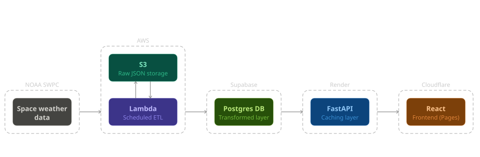
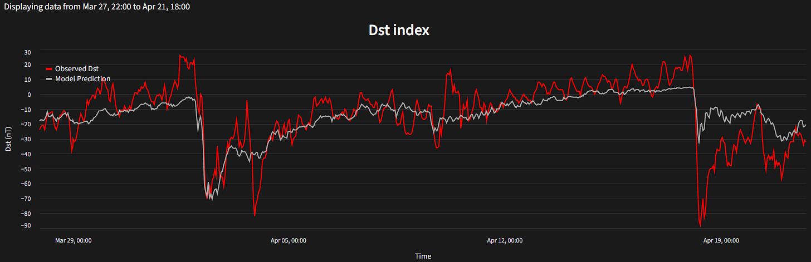

# Space Weather Dashboard

## Summary

End-to-end space weather data platform that ingests near real-time NOAA data, processes and stores it in AWS infrastructure, and runs machine learning-based Dst index predictions as part of an automated ETL pipeline. The system is orchestrated using AWS Lambda and EventBridge, with S3 for raw storage and Supabase for serving processed data. A FastAPI service holds the served data in memory and keeps it fresh by polling the database for changes, and a React frontend reads exclusively from that API. It includes handling for NOAA API schema changes, failure recovery across pipeline stages, and performance optimisation for serverless constraints.

## Motivation

My [dissertation](https://github.com/Umair539/Dissertation) involved training and testing machine learning models with historical space weather data. After working with static data, I wanted to gain experience working with live, frequently updated data, building something that continuously ingests, transforms, and delivers data to a frontend application.

Space weather was a natural fit. Having studied it through my dissertation, and with astronomy being a genuine interest of mine, it made sense to keep working in the same domain. What started as a way to gain experience ended up growing into a full production-grade AWS pipeline with automated orchestration, ML inference, and a live dashboard.

**Live Dashboard Link:** https://spaceweatherdashboard.com

---

## Tech Stack

**AWS** (Lambda · ECR · EventBridge · S3 · CloudWatch · SNS · IAM) · **FastAPI** · **React** · **Supabase** (PostgreSQL database) · **Pandas** · **ONNX** (Keras / TensorFlow) · **GitHub Actions** · **Python** · **Docker** · **Render** · **Cloudflare**

---

## Architecture

---
## Engineering Decisions

For a full record of architecture decisions and problems solved, see [DECISIONS.md](docs/DECISIONS.md).

---
## Core Logic

This project is engineered as a decoupled system where data ingestion, serving, and visualisation operate independently to ensure high availability and UI responsiveness.

### 1. Automated ETL Pipeline
* **Extract:** Pulls near-real-time JSON data from NOAA API endpoints.
* **Transform:** Uses Pandas to clean, align, and transform datasets.
* **Load:** Saves raw extracted JSON to AWS S3 as gzipped payloads, then upserts transformed data into a serverless PostgreSQL database hosted on Supabase, replacing the previous 24 hours of data to account for any updates at source.
* **Diff-Only Upserts:** Every table carries an `updated_at` column, set only when a row is new or a value has actually changed. Unchanged rows are left untouched.
* **Graceful Degradation:** Each stage failing independently means the next layer continues to serve data. Extraction failures do not affect the transform step, which falls back to the latest raw data in S3. Transform failures do not affect the dashboard, which reads from the cloud database. In the event of database failure, raw data persisted in S3 ensures the database can be fully reproduced.
* **Schema Flexible:** Handles format changes in NOAA API responses. After observing the Dst and Kp Index endpoints switching from a list of lists to a list of dictionaries format, format detection was introduced at extraction time to parse either structure correctly. The pipeline is also forward-compatible with future switches between the two formats.

### 2. ML Inference

* A CNN model trained using Keras / TensorFlow generates Dst Index predictions at the end of each ETL cycle using full hourly aggregations.
* Predictions are stored alongside the processed data, making them immediately available to the dashboard without any additional latency.
* The model was trained on historical space weather data as part of a Final Year Project at university. For full details on the architecture, training process, and evaluation, see the [dissertation repository](https://github.com/Umair539/Dissertation).
* The trained Keras model was converted to ONNX format, removing the TensorFlow dependency so that the memory consumption of the Lambda function would be significantly reduced.

### 3. API Caching Layer
* **In-Memory Store:** A FastAPI service (`api/`) holds every served table in memory, updated in place by a background poller that only fetches new or updated rows.
* **Bounded Memory:** Rolling retention per table keeps memory consumption stable.
* Hosted on **Render**.

### 4. Frontend
* **Pages:** Home, Solar Wind, Geomagnetic Indices, Solar Activity, and an interactive Aurora globe.
* **Auto-Refresh:** Charts and readings update automatically as new data arrives from the pipeline, no manual reload needed.
* Built with React and ECharts, reading exclusively from the FastAPI caching layer.
* Hosted on **Cloudflare Pages**.

### 5. Scheduled Orchestration
* The ETL pipeline is packaged as a Docker container, stored in **AWS ECR**, and deployed as an **AWS Lambda** function.
* **AWS EventBridge Scheduler** triggers the Lambda every 15 minutes, keeping both S3 and the database continuously up to date.
* **AWS CloudWatch** captures Lambda logs for monitoring and debugging each pipeline run.
* **AWS SNS** sends alarm notifications when the pipeline fails, enabling rapid incident response.
* **GitHub Actions** automates the deployment pipeline: on every push to main that changes relevant files, the Docker image is rebuilt, pushed to ECR, and the Lambda function is updated to use the latest image.
* As NOAA API endpoints only provide the last week of data, this ensures the database is kept up to date during periods of inactivity.

### 6. Testing
* **Unit tests** cover all individual transform functions -- outlier filtering, missing data handling, source fallback logic, column filtering, pressure calculation, model inference helpers, and more.
* **Component tests** cover all transform orchestrators end to end -- `process_rtsw`, `process_dst`, `process_kp`, `process_ssn`, `prepare_model_inputs`, `model_inference`, and others.
* **Integration tests** run the full transform pipeline against a fixed fixture snapshot of real NOAA data, asserting schema, null counts and datetime index integrity.
* **Coverage** of 90% across the transform layer enforced in CI, currently at 99%.
* **CI gate** runs lint, unit, component, and integration tests on every push to `main` before the Docker build, blocking deploy on any failure.

### 7. Development Environment
* A parallel dev environment mirrors the production pipeline for testing purposes.
* The dev branch runs the pipeline on GitHub Actions (in contrast to AWS Lambda/EventBridge in prod), stores raw data in a Cloudflare R2 bucket, and writes to a separate dev Supabase instance, keeping test runs fully isolated from production data.
* The API runs locally with `run_api --env dev`, loading `.env.dev` and pointing at the dev database.
* The frontend runs locally with `npm run dev` in `web/`, reading from `VITE_API_BASE_URL` (defaulting to `http://localhost:8000`).

---
## Data Source and Description
The data used in this project is retrieved from the [NOAA Space Weather Prediction Center](https://www.swpc.noaa.gov) which is the most reliable source of space weather data available. Each successful extraction retrieves the latest data from NOAA, which is appended to the database to build a continuously growing historical record. If NOAA fails after 3 retries, extraction automatically falls back to an alternative official source (see table) for 3 more retries before the dataset is marked failed for that run.

The data used can be seen in the table below

| Dataset | Resolution | Primary Features Used | Fallback Source | Notes |
| :--- | :--- | :--- | :--- | :--- |
| **Dst Index** | Hourly | `time_tag`, `dst` | Kyoto WDC | Quicklook (provisional) values. |
| **Kp Index** | 3-Hourly | `time_tag`, `Kp` | GFZ Potsdam | — |
| **Solar Wind Magnetometer** | Minute | `time_tag`, `bt`, `bz_gsm`, `by_gsm`, `bx_gsm` | AWS Open Data (S3) | — |
| **Solar Wind Plasma** | Minute | `time_tag`, `speed`, `density`, `temperature` | AWS Open Data (S3) | — |
| **Sunspots** | Daily | `Obsdate`, `swpc_ssn` | LISIRD | — |
| **Predicted Solar Cycle** | Monthly | `time-tag`, `predicted_ssn` | AWS Open Data (S3) | `predicted_ssn` represents the predicted 13-month smoothed SSN, required as part of model input. Not used for visualisation. |
| **Aurora (OVATION)** | ~5 minutes | `coordinates` (lon, lat, probability) | — | Nowcast only, served straight from the API's memory. Not stored in the database. |
