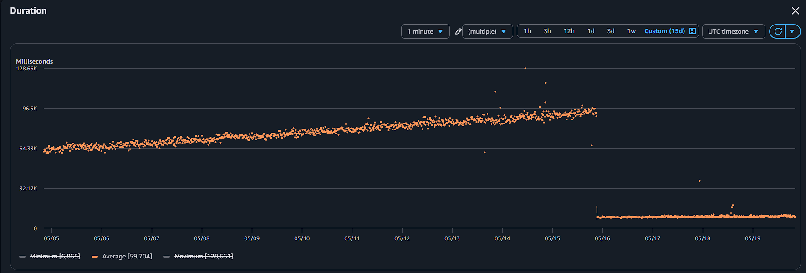

# Space Weather Dashboard — Decisions & Problems Solved

A record of real engineering decisions made and problems encountered and fixed.

---

## Architecture Evolution

At this point in the project, the ETL pipeline ran in two ways: a GitHub Actions workflow every 3 days committing updated raw data to the repo, and a background thread on the Streamlit app, running on Streamlit Community Cloud, that ran whenever the app was active to provide fresh data to users. A series of cascading problems then forced a near-complete infrastructure overhaul.

**1. TensorFlow crashes > ONNX**
The first major problem was segmentation faults and inotify errors in the deployed Streamlit app. Logs showed the majority of crashes occurred during model inference, the part of the pipeline importing Keras/TensorFlow. The Keras model was therefore converted into an ONNX model which was more lightweight but more importantly no longer required the TensorFlow library to run. This resulted in no more crashes but also significantly faster execution time.

**2. NOAA deprecating 7-day solar wind endpoints**
NOAA issued a deprecation notice for the two 7-day solar wind endpoints the pipeline relied on, replacing them with rolling 24-hour windows from a new multi-satellite source. Key changes:
- Rolling window dropped from 7 days to 24 hours, a 3-day frequency was no longer sufficient to avoid missing data
- New endpoints serve data from multiple satellites with overlapping timestamps, requiring satellite selection logic (`source`, `active` fields)
- Schema changes, different column names, additional metadata fields

This forced updates to ingestion, transformation, and scheduling.

**3. GitHub repo > Cloudflare R2, Neon > Supabase**
More frequent ETL runs meant more commits to the repo, clogging the commit history. Migrated raw data to Cloudflare R2 object storage (free egress, no commit noise). Also migrated the database from Neon to Supabase. Neon's serverless compute hour limit was becoming a real constraint with more frequent runs. Supabase has no compute hour limit; it has a 7-day inactivity pause instead, but frequent ETL runs keep it active automatically.

**4. 30-second R2 latency + 6-hour staleness**
With raw data now in R2, every background thread ETL run had ~30 seconds of latency due to R2 round trips. This wasn't a problem for background runs, but on first page load users were waiting for that ETL to complete before seeing fresh data. Combined with the GitHub Actions ETL now running on a 6-hour schedule, visitors could arrive to data up to 6 hours old.

**Attempted fix**: Remove background thread ETL and drop GitHub Actions ETL to 5-minute schedule.

**New problem**: GitHub Actions can't reliably run at 5-minute intervals, and was instead running roughly hourly.

**5. Lambda + EventBridge**
The obvious solution was a dedicated scheduler. Moved the ETL pipeline to AWS Lambda with EventBridge running every 15 minutes, guaranteed scheduling, independent of repo activity or app state. Chose AWS as the most familiar cloud provider. Migrated R2 to S3 at the same time to keep everything under one roof. At the data scale (low MBs), the cost difference was negligible, and it meant fewer environment variables and simpler infrastructure.

***Why 15 Minutes***
 
The 15-minute schedule was a tradeoff - frequent enough to keep the dashboard feeling live and useful, while keeping Lambda compute and data transfer costs across the full pipeline within free tier.

Part of this came from knowing how the data actually works. Despite being called Real-Time Solar Wind, each update already contains data that's 2-3 minutes old by the time it's published, due to transmission time from the spacecraft at L1 and ground station processing. Since some latency is already baked into the source, adding a little more through a 15-minute polling interval felt reasonable - users are always looking at near-recent data regardless.

**6. Streamlit Community Cloud > EC2**
Moved the app to a self-hosted EC2 instance to eliminate cold starts and allow for always-on availability. Co-locating app and DB in the same EU region had the additional benefit of reduced database latency.

**7. Streamlit on EC2 > React + FastAPI on Render/Cloudflare**

The final shape of the frontend. Previously: a Streamlit app, containerised on a `t4g.micro` EC2 instance with an Elastic IP, provisioned with Terraform, served over HTTPS through Nginx and Certbot, with instance access via SSM Session Manager and deploys driven by `ssm send-command`. This setup functioned smoothly with no issues, and served a purpose: it gave experience provisioning infrastructure with Terraform and setting up EC2 networking. But it had real limitations - the cost of hosting, database egress under Streamlit, and constraints on what the UI could do.

Replaced by two pieces: a FastAPI service holding the served data in memory (`api/`), hosted on Render, and a React frontend (`web/`), hosted on Cloudflare Pages.

What the change bought:

- **Substantially cheaper.** EC2 and the Elastic IP were the only line items with a real recurring cost. Render's free tier hosts the API and Cloudflare Pages hosts the static frontend, so ongoing hosting cost went to zero.
- **More frequent frontend updates.** Streamlit was polling full tables straight from the database on every refresh, eating into the available egress and keeping refreshes infrequent to stay within it. Now the API holds the data in memory and only polls Postgres for what's changed, so the database sees the same small load no matter how often the frontend refreshes - and the frontend can refresh far more often as a result.
- **More customisable UI.** React gives direct control over layout and behaviour that Streamlit's component model didn't allow, giving the site a more unique feel.
- **Far less to secure and operate.** No security groups, no Elastic IP, no Nginx config, no Certbot renewal, no SSM Session Manager, no `user_data.yaml` cloud-init, no Terraform state. TLS and DNS are Cloudflare's problem; container runtime is Render's. The remaining security surface is small enough to fit in a list (see below).

One tradeoff: EC2 was originally chosen to avoid cold starts, and Render's free tier spins the API down after 15 minutes idle. An uptime monitor pings it every 5 minutes to keep it warm.

The code for the Streamlit app and its deployment are saved on the `streamlit-app` branch for reference. The AWS infrastructure it ran on was destroyed.

---

## The Lambda Scaling Problem

The new Lambda setup worked well initially, running in ~60 seconds. Over the following weeks, duration crept up to ~90 seconds and memory usage grew in parallel, on track to exceed AWS free tier Lambda compute limits.

The root cause: Lambda was loading the entire raw JSON datasets into memory on every run. As data accumulated over time, the datasets grew continuously, so performance got worse every day.

**Fix 1 - Monthly S3 partitioning**
Replaced the monolithic `dicts.json` per folder with monthly partition files (`dicts/YYYY-MM.json`). Lambda now only reads the last 2 months of data per run. Memory usage became bounded regardless of how much historical data accumulates. Each folder also writes a `metadata.json` tracking which partition files exist.

This reduced memory significantly, but Lambda was still slow.

**Fix 2 - Vectorised `filter_source`**
Added granular logging to identify exactly where the time was going. The bottleneck was `filter_source` in `process_rtsw`, the function that selects which satellite row to use per timestamp in the RTSW (real time solar wind) data. It was implemented using `groupby().apply()` which was calling a Python function for every 2 rows in the RTSW data. So for 2 months of minute-increment data, that meant calling the function up to ~44,000 times per run for each of the 2 RTSW datasets.

The function was rewritten so that it used pandas boolean indexing: split into active/inactive DataFrames, compute validity masks vectorised across all rows, replace bad rows using index alignment. Also handles the edge case of timestamps that only exist in the inactive satellite's data.

Result locally: 2 minutes -> under 1 second for `filter_source`.

The Lambda function duration before and after the fix can be seen below.



**Note:** The Lambda function has 1024mb of assigned memory.

**Combined result on Lambda:**

| Metric | Before | After | Improvement |
|---|---|---|---|
| Duration | ~90s | ~7s | 92% faster |
| Memory used | ~524MB | ~294MB | 44% reduction |
| GB-seconds/run | 90 | 7 | 92% reduction |
| Free tier headroom | ~4,400 runs/month | ~57,000 runs/month | 13x more headroom |

Lambda duration and memory are now stable, no longer growing with time.

---

## Load-Path Optimisation

With the API caching layer and React frontend in place, the frontend could support more frequent updates without the egress cost that ruled it out under Streamlit - which made increasing the ETL's own run frequency worth pursuing. That meant getting the Lambda's load path lighter and faster first: a load refactor, threaded partition loads, gzip+orjson raw storage, and a shared S3 client.

**Storage.** Raw S3 objects moved from plain JSON to gzip+orjson. The largest single partition, `mag/dicts/2026-07`, went from 17.1 MB to 1.2 MB.

**Duration and memory.** Measured from CloudWatch, comparing a four-day baseline before the work against four days after:

| Metric | Before | After | Delta |
|---|---|---|---|
| Duration | 8.39s | 7.50s | -11% |
| Peak memory | ~357MB | ~536MB | +50% |

**Note:** memory went up, not down. These changes increased memory consumption, but the Lambda has 1024MB assigned, so it stays comfortably under the limit.

---

## The API Caching Layer

The API loads each table into memory once at startup, and a background poller checks each table on its own interval, fetching only rows with `updated_at` greater than the last fetch. Requests are served entirely from memory, so the database sees the same small load regardless of traffic.

---

## Alerting

CloudWatch alarms, notifying via SNS:

- **Per-source silence** - one alarm per data source, fires if it hasn't fetched fresh data in an hour. This is what caught the NOAA WAF issue below.
- **Schema change** - fires if the incoming data doesn't match the expected schema.
- **Lambda crash** - fires on function errors.

Plus GitHub Actions notifies on any failed deployment, or if the dev ETL pipeline crashes.

---

## NOAA WAF Blocking

`services.swpc.noaa.gov` started failing, caught by the per-source silence alarm above. Set up an alternative official source for each dataset: NOAA's S3 bucket on AWS Data Exchange (mag/plasma/predicted-solar-cycle), GFZ Potsdam (Kp, the index's official source), Kyoto WDC (Dst, the index's official source), LISIRD (sunspot number, mirrors SILSO, the authoritative source). Solar imagery moved to NASA SDO's pre-rendered animations.

---

## Other Architecture Decisions

### Security
- **AWS credentials** - GitHub Actions uses OIDC to assume an IAM role at runtime, no long-lived AWS keys stored
- **GHCR push** - uses the workflow's own `GITHUB_TOKEN` with `packages: write`, so no separate registry credential exists to leak
- **Render deploy hook** - stored as a GitHub Actions secret, and pinned to an explicit image tag rather than resolving `:latest` a second time on Render's side
- **DB read connection string** - injected as a Render environment variable, never in the image
- **DB write connection string** - stored as a Lambda environment variable
- **API read-only DB role** - the API connects with SELECT permissions only, no write access to the database
- **R2 credentials** - dev only, stored as GitHub Actions secrets for the dev ETL workflow
- **AWS root account** - IAM user with admin access used for day-to-day operations, root account not used

### Fully decoupled ETL pipeline
Load writes to storage, transform reads from storage. No data threading between stages:
```
fetch_live → load_raw → fetch_saved → transform → load_transformed
```

### ETL coupling: decoupled → coupled → decoupled

The pipeline has been through two architecture reversals on this.

Originally decoupled: `fetch_live` extracted from NOAA endpoints and wrote to storage, then separately `fetch_saved` read from storage to pass data into transform. Clean separation.

On the AWS migration, with no partitioning yet, `load_raw` was fetching the entire dataset from S3 just to append a few new rows, then `extract_saved_data` would immediately re-fetch the same full dataset to pass into transform. The data was already in memory. Coupled the stages to skip the redundant GET operation to reduce costs: pass the in-memory dataset straight into transform, only falling back to `extract_saved_data` if no new data came from the endpoint.

After monthly partitioning was introduced, this broke down. The model used for inference requires weeks of data minimum (168 full hourly aggregations). To handle a new month starting with only a day's worth of data, transform always fetches the last 2 partitions from storage. Since the partitioning logic is in `extract_saved_data` and not in the `extract_live_data` stage, there was no clean way to replicate that in-memory, therefore decoupled again.

The original coupling was a reasonable micro-optimisation at the time. Partitioning made it unworkable.

---

## Cost & Performance Optimisations

- **Managed hosting over self-hosted** - Render free tier for the API, Cloudflare Pages for the frontend; removed the EC2 instance and Elastic IP. The only remaining cost is the ETL pipeline, which is negligible
- **In-memory API cache** - request volume is fully decoupled from database load, so refresh rate is a UI decision rather than a Supabase egress cost
- **Bounded in-memory retention** - a full-history ETL backfill can't pull a year of data into the API's memory
- **ECR lifecycle policy** - retain only the latest image, old images auto-deleted to prevent silent storage accumulation
- **gzip+orjson raw storage** - smaller S3 objects, reducing per-run transfer
- **CloudWatch log retention** - 30 days, not indefinite
- **AWS Budgets alerts** - spend visibility and early warning on free tier
- **24hr upsert window** (`upsert_hours`) - minimises data transferred to Supabase each run; doubles as a full-DB recovery lever
- **`del` after large datasets in ETL** - explicit cleanup after datasets are no longer needed; minor contribution to peak memory reduction
